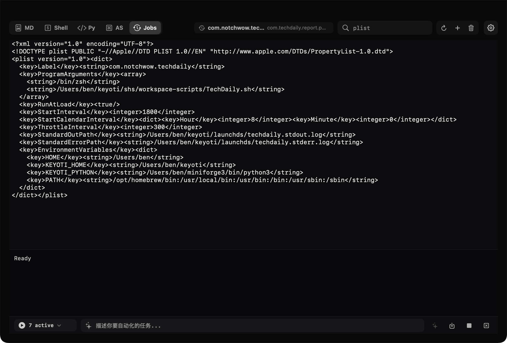

# notchwow



`notchwow` 是一个常驻 MacBook 刘海区域的原生 macOS 工作台。鼠标移到屏幕顶部中央后，紧凑面板会展开为一个深色工具抽屉，用于快速记录 Markdown、执行 Shell、运行 Python、编辑 AppleScript，以及管理 `launchd` 任务。

当前仓库已经扩展为面向本机自动化的个人工作台，并统一使用 `notchwow` 品牌。

## 功能

- Markdown 笔记：实时渲染、搜索、附件粘贴、LaTeX、代码块高亮、AI 局部修改与问答。
- Shell 工作区：脚本编辑、执行记录、命令补全、可选 Benshell 命令目录集成。
- Python 工作区：脚本编辑、Conda 环境发现、持久 REPL、脚本执行。
- AppleScript 工作区：脚本编辑、单行命令和文件执行。
- Jobs 工作区：创建、编辑、加载、卸载 `launchd` plist，并可用 AI 生成任务配置。
- Terminal 辅助：可从 Settings 中把工作目录直接在 Terminal 打开。

## 环境要求

- macOS 14 或更高版本。
- Swift 6 工具链。
- 可选：`~/miniforge3`，用于 Conda 环境发现和 Python REPL。
- 可选：`~/Desktop/Benshell`，用于加载 Shell 初始化脚本和命令目录。

## 快速开始

```bash
swift build
./script/build_and_run.sh verify
```

也可以直接运行 SwiftPM 产品：

```bash
swift run notchwow
```

展开应用后，在设置中可以修改 Markdown、Shell、Python、AppleScript 和 `launchd` 的工作目录。

## 测试

当前 Command Line Tools SDK 不带 `XCTest` 或 Swift Testing 模块，因此仓库提供可直接运行的逻辑 smoke tests：

```bash
./Scripts/test-logic.sh
```

## 打包

调试运行：

```bash
./script/build_and_run.sh run
```

Release 打包并复制到 `/Applications/notchwow.app`：

```bash
./Scripts/package-app.sh
```

公开分发前仍需要 Developer ID 签名和 notarization。

## 默认数据目录

应用默认把用户数据保存在 `~/keyoti`：

```text
~/keyoti/
├── mds/
├── pys/
├── shs/
├── applescripts/
└── launchds/
```

## 项目文档

- [架构说明](docs/ARCHITECTURE.md)
- [开发与验证](docs/DEVELOPMENT.md)
- [代码审查报告](docs/AUDIT_REPORT.md)
- [待讨论优化建议](docs/OPTIMIZATION_PROPOSALS.md)

## 发布页

项目主页和最新发布：

- [notchwow Releases](https://github.com/Benjaminisgood/Notchwow/releases/latest)
- [notchwow Homepage](docs/index.html)
